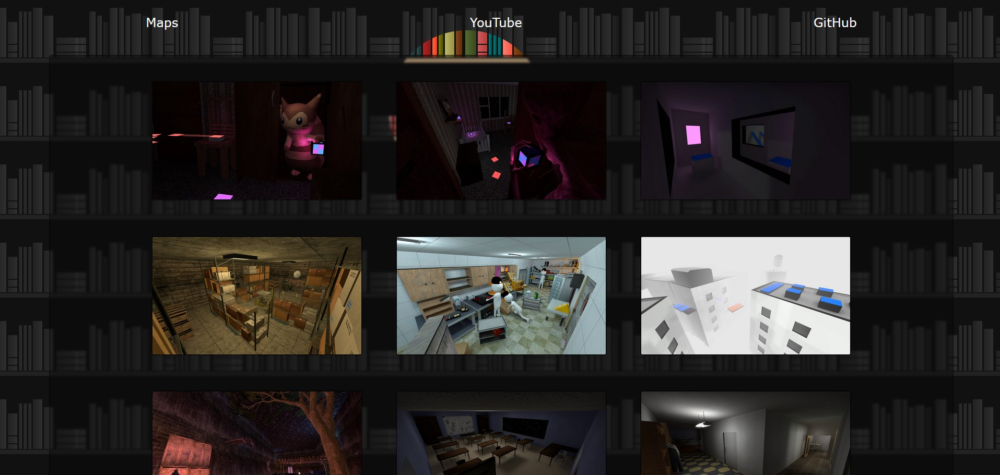

# Worldspawn Mapping History

### <a href="https://gamebanana.com/members/1695181"> My Maps (Gamebanana)</a>

### <a href="./sources/materials/"> Used Materials </a>

### <a href="./sources/models/"> Used Models </a>

### <a href="./sources/vmf/"> Some of My VMFs </a>

> This is the website and overall storage of my whole mapping (level design) experience with SourceEngine. It currently contains my maps, sources, "overused" models, sounds, materials and other stuff.

